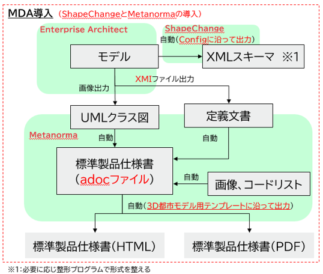

# モデル駆動型アーキテクチャによる3D都市モデル標準ドキュメントの生成・管理システム <!-- OSSの対象物の名称を記載ください。分かりやすさを重視し、できるだけ日本語で命名ください。英語名称の場合は日本語説明を（）書きで併記ください。 -->

 <!-- OSSの対象物のスクリーンショット（画面表示がない場合にはイメージ画像）を貼り付けください -->

## 更新履歴
| 更新日時 | リリース | 更新内容 |
| ---- | ---- | ---- |
| 2025/3/11 | 1st Release | 初版リリース |

## 1. 概要 <!-- 本リポジトリでOSS化しているソフトウェア・ライブラリについて1文で説明を記載ください -->
本リポジトリでは、Project PLATEAUの令和6年度のユースケース開発業務の一部であるdt24-01「3D都市モデル標準製品仕様書等の可用性向上」について、その成果物である「モデル駆動型アーキテクチャによる3D都市モデル標準ドキュメントの生成・管理システム」のリソースを公開しています。

「モデル駆動型アーキテクチャによる3D都市モデル標準ドキュメントの生成・管理システム」は、モデル駆動型アーキテクチャを活用し、3D都市モデル標準ドキュメントの生成・管理におけるリソースの一元化と生成の自動化を図るシステムです。

## 2. 「モデル駆動型アーキテクチャによる3D都市モデル標準ドキュメントの生成・管理システム」について <!-- 「」内にユースケース名称を記載ください。本文は以下のサンプルを参考に記載ください。URLはアクセンチュアにて設定しますので、サンプルそのままでOKです。 -->
モデル駆動型アーキテクチャ（MDA）は、ソフトウェア開発手法の一種で、実装方法に依存しないモデルから実装となるプログラムを生成する仕組みです。MDAをドキュメント化のフローに導入することによって、モデリングツール等のソース情報から、具体的な実装となるPDFやHTMLといった各種形式の標準ドキュメントを、自動生成する仕組みを構築します。

具体的にはクラス図画像の出力に利用しているEnterprise Architect（EA）のモデル情報をソース情報（概念モデル）として、フリーのソフトウェアであるShapeChangeとMetanormaを導入することで、製品に付属するurfとuroのXSD（符号化仕様）と、3D都市モデルのドキュメントを生成するフローとなります。

本システムの詳細については[技術検証レポート](https://www.mlit.go.jp/plateau/file/libraries/doc/plateau_tech_doc_0030_ver01.pdf)を参照してください。

## 3. 利用手順 <!-- 下記の通り、GitHub Pagesへリンクを記載ください。URLはアクセンチュアにて設定しますので、サンプルそのままでOKです。 -->
本システムの構築手順及び利用手順については[利用チュートリアル](https://r5-plateau-acn.github.io/SolarPotential/)を参照してください。

## 4. システム概要 <!-- OSS化対象のシステムが有する機能を記載ください。 -->
### 【概念モデルと符号化仕様の作成】
#### ①EAのプロジェクトファイル変換
- EAのプロジェクトファイルはeapx形式を用い散るが、EAの標準機能を用いて、ShapeChangeで読み込み可能なqea形式に変換します。

#### ②ShapeChangeのXSD出力
- qea形式のプロジェクトファイルから、ShapeChangeでurfとuroのXSDを出力します。

#### ③XSD整形
- 建出力したXSDを、3D都市モデルで利用する形式に整形します（整形プログラムにはVBAを用います）。

### 【概念モデルとドキュメント作成】
#### ④EAのモデル・ダイアグラム画像出力
- EAの標準機能を用いて、Metanormaが読み込むXMI（メタデータ情報を交換する標準規格でUMLモデルの交換形式として利用される）とUMLクラス図の画像ファイルを出力します。

#### ⑤Metanormaによるドキュメント生成
- Metanormaによって、XMIファイルやUMLクラス図をはじめとした画像ファイル、そしてMetanormaADOC形式（軽量マークアップ言語であるAsciiDocに一部拡張と制限を加えた言語）のadocファイルをコンテンツとして、3D都市モデルのスタイルを指定することにより、3D都市モデルの標準製品仕様書と標準作業手順書を自動生成します。

## 5. 利用技術

| 種別              | 名称   | バージョン | 備考 |
| ----------------- | --------|-------------|-----------------------------|
| ミドルウェア       | [Enterprise Architect](https://python-poetry.org/) | 16.1 | ※ライセンス要 |
|       | [ShapeChange](https://libgeos.org/) | 3.1.0 | 実体はJARファイルであり、起動させるためにJRE11環境を構築する |
|       | [Ruby](https://proj.org/) | 3.3.6 | Metanormaは主としてRubyのGemで構成される |
|       | [Microsoft Office Excel] | - | ※ライセンス要 |

## 6. 動作環境 <!-- 動作環境についての仕様を記載ください。 -->
| 項目               | 最小動作環境                                                                                                                                                                                                                                                                                                                                    | 推奨動作環境                   | 
| ------------------ | ----------------------------------------------------------------------------------------------------------------------------------------------------------------------------------------------------------------------------------------------------------------------------------------------------------------------------------------------- | ------------------------------ | 
| OS                 | Microsoft Windows 10 または 11                                                                                                                                                                                                                                                                                                                  |  Microsoft Windows 11 | 
| CPU                | Intel Core i7以上                                                                                                                                                                                                                                                                                                                               | Intel Core i7以上              | 
| メモリ             | 16GB以上                                                                                                                                                                                                                                                                                                                                         | 同左                        | 
| ディスプレイ解像度 | 1024×768以上                                                                                                                                                                                                                                                                                                                                    |  同左                   | 
| その他　　　       | ・利用可能なメモリは20～30G程度を確保 ・ShapeChangeはEAと同じマシンにJRE11以上で環境構築する、 ・インターネットにアクセス可能であり、各ミドルウェアがセキュリティで制限されない |  同左                            | 

## 7. 本リポジトリのフォルダ構成 <!-- 本GitHub上のソースファイルの構成を記載ください。 -->
| フォルダ名 |　詳細 |
|-|-|
| 001-v5 | 標準製品仕様書のコンテンツを格納 |
| 002-v5 | 標準作業手順書のコンテンツを格納 |
| guidance | 応用スキーマ文書にカスタマイズをする場合にyamlファイルを格納（初版リリースでは未利用） |
| liquid_templates | Metanorma出力で利用するliquidファイルを格納 |
| xmi | EAから出力した「plateau_all_packages_export.xmi」を格納 |
| EAandSC | EAのプロジェクトファイル、ShapeChangeのConfig、整形プログラム（ExcelVBA）を格納 |

## 8. ライセンス <!-- 変更せず、そのまま使うこと。 -->

- ソースコード及び関連ドキュメントの著作権は国土交通省に帰属します。
- 本ドキュメントは[Project PLATEAUのサイトポリシー](https://www.mlit.go.jp/plateau/site-policy/)（CCBY4.0及び政府標準利用規約2.0）に従い提供されています。

## 9. 注意事項 <!-- 変更せず、そのまま使うこと。 -->

- 本リポジトリは参考資料として提供しているものです。動作保証は行っていません。
- 本リポジトリについては予告なく変更又は削除をする可能性があります。
- 本リポジトリの利用により生じた損失及び損害等について、国土交通省はいかなる責任も負わないものとします。

## 10. 参考資料 <!-- 技術検証レポートのURLはアクセンチュアにて記載します。 -->
- 技術検証レポート: https://www.mlit.go.jp/plateau/file/libraries/doc/plateau_tech_doc_0030_ver01.pdf
