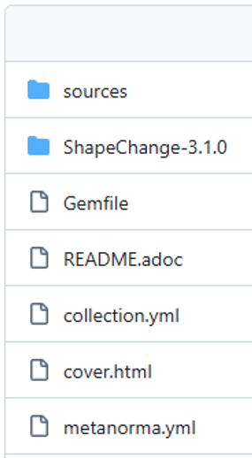
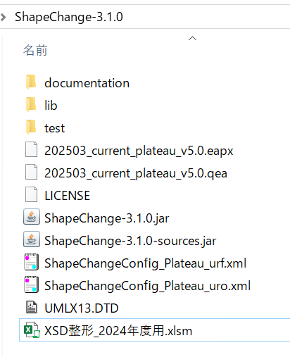

# 環境構築手順書

# 1 本書について

本書では、モデル駆動型アーキテクチャによる3D都市モデル標準ドキュメントの生成・管理システム（以下「本システム」という。）の利用環境構築手順について記載しています。

本システムは複数のアプリから構成されます。ライセンスがフリーのアプリが「ShapeChange」（JavaのJARファイル）と「Metanorma」（Rubyのgem）、ライセンスが必要なアプリが「Enterprise Architect」（EAと略す）と「Microsoft Office Excel」です。

ライセンスが必要なアプリの環境構築については記載を省略します。

本システムの構成や仕様の詳細については、レポジトリに格納したリソースフォルダ直下のマニュアルや、以下も参考にしてください。

[技術検証レポート](https://www.mlit.go.jp/plateau/file/libraries/doc/plateau_tech_doc_0030_ver01.pdf)

# 2 動作環境

本システムの動作環境は以下のとおりです。

| 項目 | 最小動作環境 | 推奨動作環境 | 
| - | - | - | 
| OS | Microsoft Windows 10 または 11 | Microsoft Windows 11 | 
| CPU | Intel Core i7以上 | 同左 | 
| メモリ | 16GB以上 | 同左 | 
| その他       | ・利用可能なメモリは20～30G程度を確保すること ・ShapeChangeはEAと同じマシンにJRE11以上で環境構築すること ・インターネットにアクセス可能であり、各ミドルウェアがセキュリティで制限されないこと |  同左                            | 

# 2 本システムのリソース

システムを構成する各アプリが利用するリソースは
[こちら](https://github.com/Project-PLATEAU/UC22-013-SolarPotential/releases/)
からダウンロードします。
ダウンロード後、zipファイルを右クリックし、「すべて展開」を選択することで、zipファイルを展開します。

# 3 構築手順（EAのプロジェクトファイルとShapeChange）

ShapeChangeはEAのプロジェクトファイルからurfとuroのXSDを出力するのに利用します。本システムではVer3.1.0を利用しているため、利用マシンにはJRE11の環境をご準備ください。

[ShapeChange-3.1.0](https://shapechange.net/resources/dist/net/shapechange/ShapeChange/3.1.0/ShapeChange-3.1.0.zip)

解凍したフォルダーを、そのまま作業用フォルダー（以下「ShapeChange-3.1.0フォルダー」という）として利用できます。

ShapeChange-3.1.0フォルダーの「ShapeChangeConfig_Plateau_urf.xml」がurfの、「ShapeChangeConfig_Plateau_uro.xml」がuroのConfigファイルです。

また、ShapeChange-3.1.0フォルダーの「202503_current_plateau_v5.0.eapx」がEAのプロジェクトファイルで、このファイルから出力したqeaファイルも、ShapeChange-3.1.0フォルダーに格納して利用します。

なお、展開されたリソース内の「XSD整形_2024年度用.xlsm」が、ShapeChangeで出力したXSDの整形プログラムを実装しています。

# 4 構築手順（Metanorma）

Metanormaは、adocファイルや画像ファイル等から構成されたコンテンツから、指定したスタイルでドキュメントを生成（ビルド）します。

展開されたフォルダ内の「sources/001-v5/document.adoc」が標準製品仕様書、「sources/002-v5/document.adoc」が標準作業手順書を指定して、ビルドを実行します。

Metanormaの開発環境は下記の通り構築します。

（1）下記サイトから、RubyのWindows向けでWITH DEVKITのインストーラをDLして、インストールを実行します（オプションはすべてデフォルトとします）。完了画面にて下図のチェックボックスを選択し、「Finish」ボタンを押下するとコマンド画面が立ち上がってくるので、ENTERを押下します（レスポンスが遅いので留意してください）。

[Rubyインストーラー](https://rubyinstaller.org/downloads/)

（2）コマンド画面が閉じたら、管理者モードでPowerShellを立ち上げ、「ruby –v」コマンドを実行し（インストールVerが確認できればインストールできている）、そのまま「gem install metanorma-cli」にてメタノーマをインストールしてください。

（3）インストールマシンにJava実行環境がない場合は、JRE11で環境を構築ください（MetanormaのPDF出力機能はJavaを利用しています）。

# 5 その他

adocファイルの編集はテキストエディターで可能ですが、Visual Studio Codeにて、下記の拡張機能の利用を推奨します。

