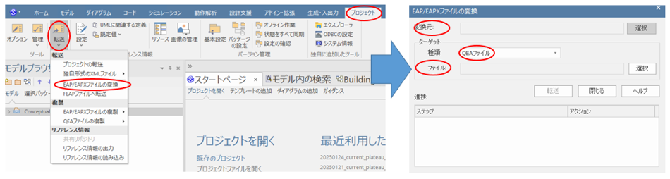
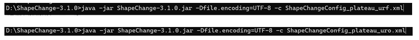
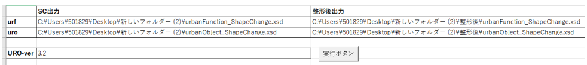
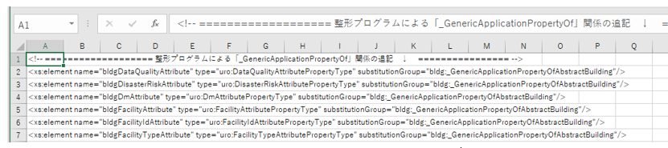
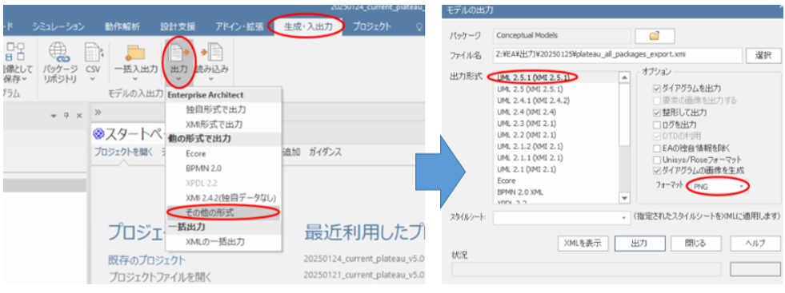
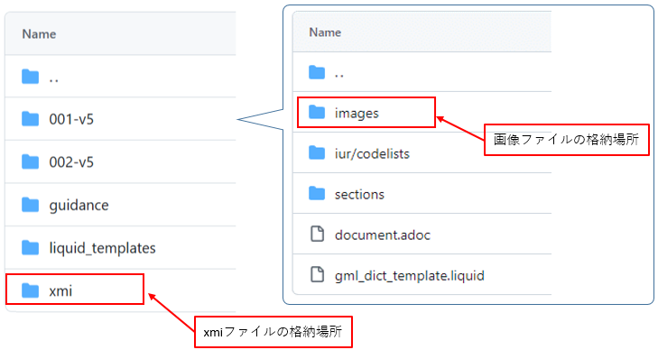
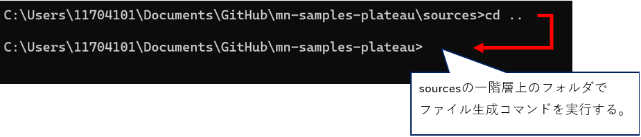

# 操作マニュアル

# 1 本書について

本書では、モデル駆動型アーキテクチャによる3D都市モデル標準ドキュメントの生成・管理システム（以下「本システム」という。）の操作手順について記載しています。

本システムの構成や仕様の詳細については、レポジトリに格納したリソースフォルダ直下のマニュアルや、以下も参考にしてください。

[技術検証レポート](https://www.mlit.go.jp/plateau/file/libraries/doc/plateau_tech_doc_0030_ver01.pdf)

# 2 概念モデルと符号化仕様の作成

## 2-1 qea変換のオペレーション

ShapeChangeでXSDを出力するため、「Enterprise Architect」（以下、「EA」と略す）のプロジェクトファイルから、qea形式のプロジェクトファイルを出力します。

① EAにて、「メインメニュー」の「プロジェクト」の「転送」から、「EAP/EAPXファイルの変換」を選択します

② サブウインドウから、インプットを元のプロジェクトファイル、出力を「QEAファイル」で任意の名前を設定し、転送します。

③ 変換したqeaファイルは、ShapeChangeのJARファイルと同一階層に配置するようにしてください。

## 2-2 XSD出力のオペレーション

qeaファイルからShapeChangeを利用して、urfとuroのXSDを出力します。

① PowerShellを管理者モードで開き、カレントディレクトリをShapeChange のJARファイルのあるフォルダーに変更します。

② 「java -jar ShapeChange-3.1.0.jar -Dfile.encoding=UTF-8 -c AAA」（AAAはConfigファイルのパスとします）を実行すると、Config指定の出力先にXSDが出力されます。

・Configファイルはurfとuroで二つあります、AAAを書き換えて二回実行ください。

## 2-3 XSD整形のオペレーション

XSDを3D都市モデルで利用する形に整形します。

① 「XSD整形_2024年度用.xlsm」のワークシート「do」の表に、urf/uroの入出力XSD、及びuroのVerを小数点以下一位まで設定します。

② ワークシート「uro_add」に、uroで追加したい行を設定します。

③ 「実行ボタン」を押下すると、設定したパスにXSDが出力されます

# 3 概念モデルとドキュメント作成

## 3-1 XMIとUMLクラス図画像の出力オペレーション

EAから標準製品仕様書にレンダリングするUMLクラス図画像と、応用スキーマ文書のソースとなるXMIファイルを出力します。

① EAにて、「メインメニュー」の「生成・入出力」の「出力」から、「その他の形式」を選択します。

② サブウインドウにて下図の出力設定を行い、出力ボタンを押下します。

・ダイアグラムの画像フォーマットを、SVGとPNGのそれぞれを設定して、二回出力を行います。

・パッケージはプロジェクトファイルのTOPプロジェクトを選択し、出力ファイル名は「plateau_all_packages_export.xmi」としてください。

③ Metanormaリソースのフォルダーにて、「sources/xmi」にXMIファイルを上書き保存し、画像は「sources/001-v5/images」フォルダに上書き保存します。

## 3-2 ファイル生成のオペレーション

Metanormaを使い、adocやXMI、画像ファイルといったリソースファイル一式から標準製品仕様書と標準作業手順書を出力します。

① PowerShellを管理者モードで開き、カレントディレクトリを、「Metanormaコンテンツ用TOPフォルダー」（sourcesの一つ上の階層）に変更します。

② カレントディレクトリから「Gemfile.lock」ファイルがある場合は削除します。

③ PowerShellにて、「bundle install」を実行し、実行完了後に「bundle update」を実行します。

④ PowerShellにて、下記のとおり生成コマンドを実行します。

| 生成対象             | コマンド　                                           | 出力先                                                               |
| -------------------- | ---------------------------------------------------- | -------------------------------------------------------------------- |
| ・標準製品仕様書     | bundle exec metanorma sources/001-v5/document.adoc   | sources/001-v5                                                       |
| ・標準作業手順書     | bundle exec metanorma sources/002-v5/document.adoc   | sources/002-v5                                                       |
| ・同時出力　　       | bundle exec metanorma site generate --agree-to-terms | 「Metanormaコンテンツ用TOPフォルダー」直下に生成される出力フォルダー |

